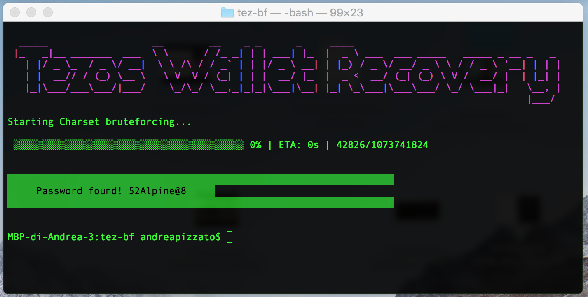

# tez-recovery - Tezos Wallet Recovery tool


Did you forget your TezBox browser password? Do you have your mnemonic words list but forgot the passphrase to restore your wallet?

I did, and decided to write this tool to help re-gaining access to my wallet. It worked, and now it's available to you too.

This tool is written for Node.js and it's easy to use and easy to install.

## Installation
### Open the Terminal
Go to your PC/Mac applications, and open a Terminal (*Terminal* on OSX or Linux, *Command Prompt* on Windows).

### Check you have Node.js
Write this command:
```bash
node -v
```
and press Enter on the keyboard. If it complains about node somehow, please head to the link above and **download and install the LTS version of Node.js** for your operative system.

[Download Node.js LTS Version](https://nodejs.org)

If everything is ok or after the installation + reboot, the above command should return a version number (e.g. vXX.X.X).

### Grab your copy of tez-recovery
[Download the last version of tez-recovery as ZIP archive](https://github.com/andreapizzato/tez-recovery/archive/master.zip)

After clicking on the link above, the download should start soon. When completed, please extract the contents of the archive to a folder which is easy to access (Desktop, Documents or so).

If not already open, please re-open the Terminal as explained in the first section of the installation guide.
Write ```cd``` in your Terminal, add a single white-space and then drag and drop the freshly-extracted folder into the Terminal window.
The result should be something like:
```bash
cd [PATH/TO/YOUR/TEZ-RECOVERY/FOLDER]
```
then press Enter.

### Let it automatically grab the dependencies
If all has gone like planned, at this point you should be able to let Tezos Wallet Recovery tool download its dependencies automatically.
It will download <15MB of files from the internet.

Note that all the downloaded libraries will be installed in the node_modules folder inside the extracted ZIP folder. This is good, as the only thing to do when finished recovering your tool will be to delete it and all the related files will go away with it.

In the Terminal write:
```bash
npm install
```
and press Enter. You'll see the installation process take place and finish before the blinking cursor comes back in its original "write a command" position.

### Test if your installation is ready
In the Terminal write:
```bash
npm start test
```
and press Enter. The tool should give a friendly sign of readyness if you followed all the steps correctly 'till this point. Otherwise, please check you've performed all the steps of Installation.

## Security
**IMPORTANT:**
**This software writes a configuration file (config.json) which will includes sensitive data. For this reason, I strongly recommend you to delete your config file once finished or if you leave the computer to others.**

**Please DON'T use this software in public computer (like internet cafès, libraries or schools).**

**If you're concerned about security please put yourself offline as the recovery process is started.**

**I don't collect any data of yours, and I will not be responsible if you loose control over your configuration file (config.json) and this gives strangers access to your wallet in any way.**

## Usage
To put Tezos Wallet Recovery tool at work you have to configure it first using the built-in configurator.

To do this, in the Terminal write:
```bash
npm start config
```
This command will help you to prepare the recovery process, possibly speeding it up.

You'll need to know:
* Your Tezos Wallet public key (e.g. *tz1...*)
* Your mnemonic words list (e.g. *apples cat radio...*)

When finished, in the Terminal write:
```bash
npm start recovery
```
Cross your fingers, let Tezos Wallet Recovery tool find your missing passphrase.

## Credits
### About the author
Tezos Wallet Recovery tool was written by Andrea Pizzato.

### Libraries
Tezos Wallet Recovery tool uses the awesome *EZTZ* library written by Stephen Andrews which you can find at:

[eztz - Javascript API library for Tezos](https://github.com/stephenandrews/eztz)

## License
GPL v3

## Support
If you need support please join me on the Telegram channel:

[@TezRecovery](https://t.me/tezosrecovery)

## Contribute
### Making proposals
If you have any ideas about this tool, please take the time to write a message to this Telegram channel:

[@TezRecovery](https://t.me/tezosrecovery)

### Programming
If you have enhancements or bug fixes feel free to make a pull request. I'll merge them all after reviewing them as fast as possible.

### Opening issues
If you spot a bug using this software, please open an issue on [GitHub's issue tracker](https://github.com/andreapizzato/tez-recovery/issues).

### Donating
If this tool helped you regaining access to your lost wallet, please consider making a donation at my **Tezos wallet address**:
```
tz1WAfg34G7aTxi4Y96c4yWJ2trU5YNNLweV
```
This will help me improving Tezos Wallet Recovery tool and other open source software to help other people like you.